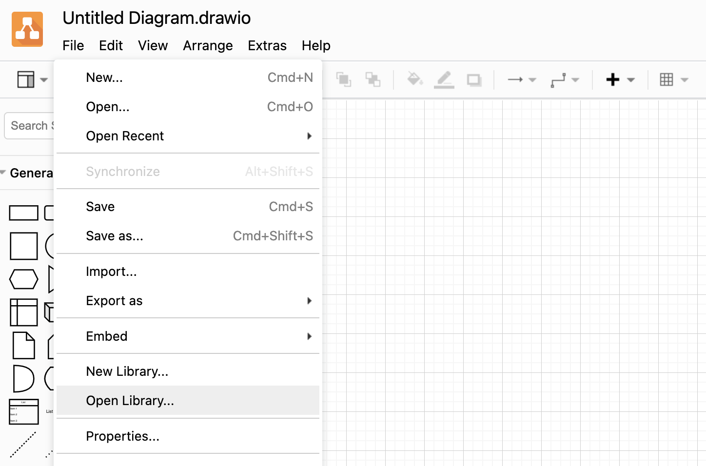
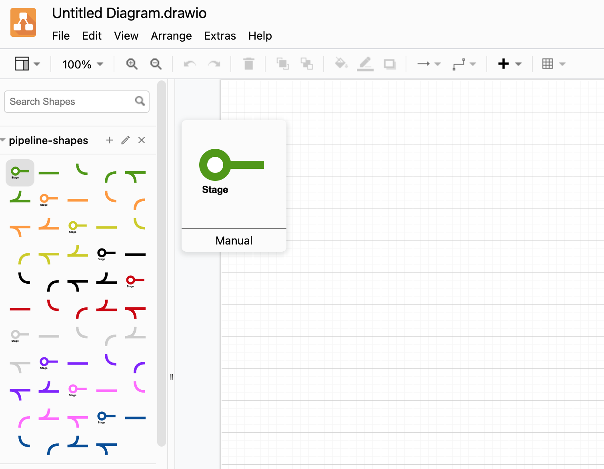

# devsecops-architecture-tools

 

***NOTE: To add a vendor or product logo to this project, please use the [addition request](https://github.com/djschleen/devsecops-architecture-tools/issues/new/choose) form.***

## Overview

Over the years I've created many DevSecOps Reference architectures for the various organizations that I've worked at. One of the [largest architectures](https://www.sonatype.com/resources/white-paper-test-drive-a-devsecops-reference-architecture) I've created was when I was working as a DevSecOps Evangelist at Sonatype. I've been asked many times for some of the tools and utilities that I've used to create these architectures, and this is what this repository is meant to help with.

## Tools and Content

This repository contains the following tools and content:

| Content | Location | Description |
|---|---|---|
| Draw.io pipeline libraries | [drawio/libaries](drawio/libraries/) | You can find all of the cool subway pipeline graphics you may have seen in my reference architectures in this draw.io importable library. All components are sized at 80pt x 80pt so they can be easily snapped together to create diagrams. |
| Product Images | [img/products](img/products/) | This folder contains product logos for many DevOps related tools (open and closed source). Where possible, files end in ```-logo``` for a full logo and ```-icon``` for a product icon. |
| Vendor Images | [img/vendors](img/vendors/) | This folder contains vendor logos for companies that you'll regularly encounter when building out DevOps/DevSecOps pipelines. Where possible, files end in ```-logo``` for a full logo and ```-icon``` for a product icon. |

## Using the diagrams.net (draw.io) pipeline library

### Get draw.io
[diagrams.net](https://diagrams.net) (previously draw.io) is a free and open source cross-platform graph drawing software developed in HTML5 and JavaScript. Its interface can be used to create diagrams such as flowcharts, wireframes, UML diagrams, organizational charts, and network diagrams. You can download an entire working copy from the website, or from [github.com](https://github.com/jgraph/drawio-desktop). It's also available as a snap if you are using Ubuntu.

### Open the pipeline-shapes libary

1. Once you open Draw.io, select "Open Library" from the "File" Menu 



2. Open the [pipeline-shapes.xml](drawio/libraries/pipeline-shapes.xml) file.



3. Start drawing!

## Contributing vendor and product logos
If you would like to add a logo for your organization and/or product to this repository, please create an [addition request](https://github.com/djschleen/devsecops-architecture-tools/issues/new/choose). Ideally, you'll provide links to SVG format files, but if you don't have any available, feel free to submit a PNG format file. Ensure that any PNG file has a transparent background and is as large as you can find. Your request will be reviewed and added to the repository if it is a DevOps/DevSecOps related tool. 

Please provide as much information in the request as possible. You may see your product appear in my next reference architecture. I love to try out new tools as well, so feel free to provide any demo information.

## Important note about vendor and product Logos

I've gathered many high quality vendor and product logos from around the open source community and through the various relationships I've had with the vendor community and included them here. It's important to note that all logos and images are the sole property of their respective owners. Where possible, there will be links to any usage guidelines if they have been provided with the logo assets.

If you are a trademark or copyright owner and *DO NOT* want your logos to be in this repository, please create a [removal request](https://github.com/djschleen/devsecops-architecture-tools/issues/new/choose) in this repository to request removal.

All content in this project is provided on an “as-is” and “as available” basis, and it’s intended for non-commercial, informational purpose only, and to educate and inform. Source code (included in the [bin/](bin/) directory) is covered under the [Mozilla Public License Version 2.0](LICENSE). There is no warranty that any of the materials in this project are accurate, complete or current.

For questions about using any of the logos and brand elements, please contact the copyright and/or trademark holder directly to request a licensed agreement.

Please note that any images appearing in this project may not be associated with or sponsored by the copyright and/or trademark holder.

## Reference Architectures
### Sonatype DevSecOps Reference Architecture

Successful DevSecOps practices encompass people, processes, tools, and measurement.

But where should you start, how can you validate your existing practices, and what are the possibilities? This reference architecture file helps also you answer the following questions:

* Where can we further automate manual, security, and business tasks?
* What DevSecOps tools and integrations are others deploying?
* What interactions do we need to be aware of or map out?

View, modify, and save a version customized to your needs. Our draw.io file format can be used with draw.io, Visio, and Lucidchart. A static PDF version is also available.

Download my [Sonatype DevSecOps Reference Architecture](https://www.sonatype.com/resources/white-paper-test-drive-a-devsecops-reference-architecture)


## Credits

A big thank-you to [Nikita Golubev](https://www.flaticon.com/authors/nikita-golubev) for the repository logo.

A huge shout out to [FlatIcon](https://www.flaticon.com) and all of their contributors for the [icons](img/icons/) used by this project.